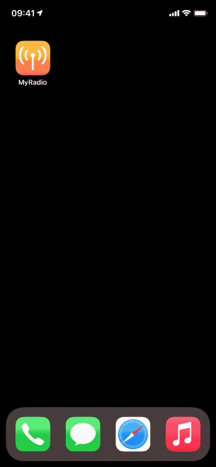

#  MyRadio

An alternate livestream radio player to listen to SRG radio stations using their livestreams.
Access to the SRG SSR API requires a valid API key and secret (see `Config.xcconfig`) which can be obtained from the [SRG SSR developer portal](https://developer.srgssr.ch).

Another interesting learning project covering the following topics:

- SwiftUI
- Combine
- REST API using OAuth authentication
- AVFoundation/AVKit for a custom audio player and "Now Playing" & remote control
- Spotlight
- iOS Extensions
    - Siri extension
    - Widget extension
- Settings bundle
- App groups to share data between main app and extensions

## Impressions

## Components

### Main parts

- MyRadio App, MyRadio Widget, MyRadio Siri Intents
- SRGSSR REST API Server: api.srgssr.ch
  - OAuth
  - Request livestreams, mediaComposition
- Image Server: e.g. ws.srf.ch
- Livestream Data Server: lsaplus.swisstxt.ch/audio/

### UI/Views

- MyRadioApp
- ContentView
- LivestreamRow
- WhatsPlayingToolbar
- PlayingSheet

### Model / Controller

- MyRadioModel
- AudioController
- ImageCache
- Livestream
- LivestreamStore
- BusinessUnit
- SettingsStore

### Networking / API Service

- OAuthenticator
- NetworkClient
- SRGService
